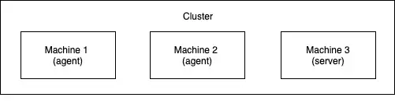
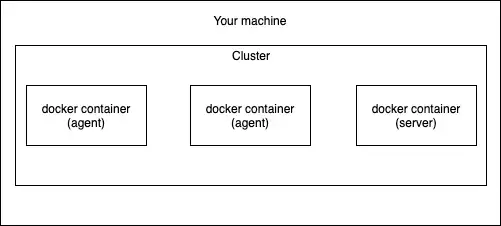
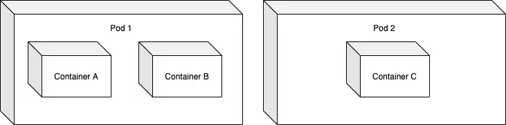
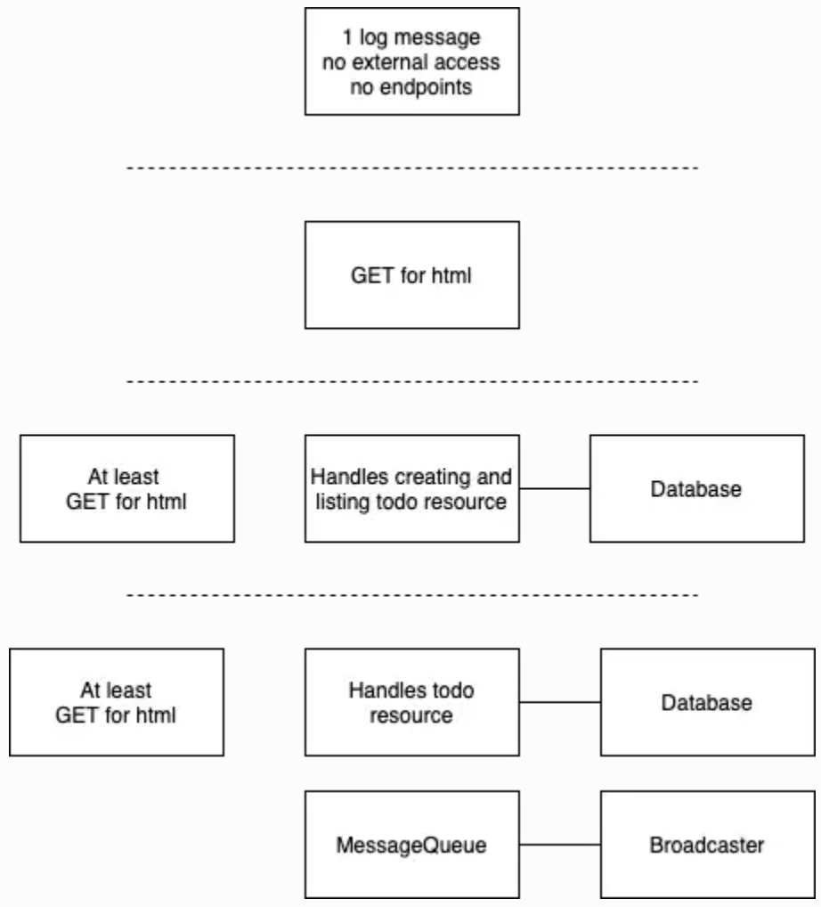

# Capítulo 2: Noções básicas de Kubernetes

### Conteúdo
- [Noções básicas de Kubernetes](#capítulo-2-noções-básicas-de-kubernetes)
  - [O que são microsserviços?](#o-que-são-microsserviços)
  - [O Container Engine](#o-container-engine)
    - [OCI - Open Container Initiative](#oci---open-container-initiative)
    - [O Container Runtime](#o-container-runtime)
  - [O que é Kubernetes?](#o-que-é-kubernetes)
  - [O que é um cluster?](#o-que-é-um-cluster)
  - [Arquitetura do k8s](#arquitetura-do-k8s)
  - [Portas que devemos nos preocupar](#portas-que-devemos-nos-preocupar)
  - [Conceitos-chave do k8s](#conceitos-chave-do-k8s)
  - [Instalando e customizando o Kubectl](#instalando-e-customizando-o-kubectl)
    - [Instalação do Kubectl no GNU/Linux](#instalação-do-kubectl-no-gnulinux)
    - [Instalação do Kubectl no MacOS](#instalação-do-kubectl-no-macos)
    - [Instalação do Kubectl no Windows](#instalação-do-kubectl-no-windows)
    - [Auto-complete](#auto-complete)
  - [Instalando o k3d](#instalando-o-k3d)
  - [Iniciando um cluster com k3d](#iniciando-um-cluster-com-k3d)
  - [Primeiro Deploy](#primeiro-deploy)
    - [Preparando-se para o primeiro deploy](#preparando-se-para-o-primeiro-deploy)
    - [Aplicações de exemplo](#aplicações-de-exemplo)
    - [Deployment](#deployment)
    - [O que é um Pod?](#o-que-é-um-pod)
      - [Criando um Pod](#criando-um-pod)
      - [Visualizando detalhes sobre os Pods](#visualizando-detalhes-sobre-os-pods)
      - [Criando um Pod através de um arquivo YAML](#criando-um-pod-através-de-um-arquivo-yaml)
      - [Visualizando os logs do Pod](#visualizando-os-logs-do-pod)
      - [Criando um Pod com mais de um container](#criando-um-container-com-limites-de-memória-e-cpu)
      - [Os comandos `attach` e `exec`](#os-comandos-attach-e-exec)
      - [Criando um container com limites de memória e CPU](#criando-um-container-com-limites-de-memória-e-cpu)
      - [Adicionando um volume EmptyDir no Pod](#adicionando-um-volume-emptydir-no-pod)
    - [O que é um recurso Deployment?](#o-que-é-um-recurso-deployment)
    - [O projeto do curso](#o-projeto-do-curso)
    - [Configuração declarativa com YAML](#configuração-declarativa-com-yaml)
    - [Editor de texto de preferência](#editor-de-texto-de-preferência)


### O que são microsserviços?
Neste curso, falaremos sobre microsserviços e criaremos microsserviços. Antes de começarmos qualquer outra coisa, precisamos definir o que é um microsserviço. Atualmente, existem muitas definições diferentes para microsserviços.

Para este curso, escolheremos a definição estabelecida por Sam Newman no livro [Building Microservices](https://www.oreilly.com/library/view/building-microservices/9781491950340/):


***"Microsserviços são serviços pequenos e autônomos que trabalham juntos."***

O oposto de um microsserviço é um serviço ou aplicação independente e autossuficiente chamado [Monólito](https://en.wikipedia.org/wiki/Monolithic_application).

Quando usar microsserviços? No vídeo em que Sam Newman e Martin Fowler discutem microsserviços, a resposta é: "Quando você tiver um motivo muito bom".
A discussão também inclui os 3 principais motivos para usar microsserviços:

- Implantação independente sem tempo de inatividade (Zero-downtime independent deployability)

- Isolamento de dados e do processamento em torno desses dados

- so de microsserviços para refletir a estrutura organizacional

&nbsp;

<p align="center">
  <a href="https://www.youtube.com/watch?v=GBTdnfD6s5Q">
    
  </a>
</p>

&nbsp;

Uma aplicação que segue uma arquitetura de microsserviços é composta por vários — potencialmente até dezenas — de serviços que operam de forma independente. Gerenciar e operar um sistema tão complexo é um desafio. É aqui que o Kubernetes entra em ação.

&nbsp;
### O Container Engine

Antes de começar a falar um pouco mais sobre o Kubernetes, nós primeiro precisamos entender alguns componentes que são importantes no ecossistema do Kubernetes, um desses componentes é o Container Engine. 

O *Container Engine* é o responsável por gerenciar as imagens e volumes, ele é o responsável por garantir que os os recursos utilizados pelos containers estão devidamente isolados, a vida do container, storage, rede, etc.

Até pouco tempo atrás tinhamos somente o Docker para esse papel. Mas hoje já temos diversas opções para se utilizar como *Container Engine*.

Opções como o Docker, o CRI-O e o Podman são bem conhecidas e preparadas para o ambiente produtivo. O Docker, é o Container Engine mais popular e ele utiliza como Container Runtime o containerd.

&nbsp;
#### OCI - Open Container Initiative

A OCI é uma organização sem fins lucrativos que tem como objetivo padronizar a criação de containers, para que possam ser executados em qualquer ambiente. A OCI foi fundada em 2015 pela Docker, CoreOS, Google, IBM, Microsoft, Red Hat e VMware e hoje faz parte da Linux Foundation.

O runc, principal projeto desenvolvido pela OCI, é um container runtime de baixo nível amplamente utilizado por diversos Container Engines, incluindo o Docker. Este projeto, totalmente open source, é escrito em Go e seu código fonte pode ser acessado no GitHub.


&nbsp;
#### O Container Runtime

Para que seja possível executar os containers nos nós é necessário ter um *Container Runtime* instalado em cada um desses nós.

O *Container Runtime* é o responsável por executar os containers nos nós. Quando você está utilizando ferramentas como Docker ou Podman para executar containers em sua máquina, por exemplo, você está fazendo uso de algum *Container Runtime*, ou melhor, o seu Container Engine está fazendo uso de algum *Container Runtime*.

Temos três tipos de *Container Runtime*:

- Low-level: são os *Container Runtime* que são executados diretamente pelo Kernel, como o runc, o crun e o runsc.

- High-level: são os *Container Runtime* que são executados por um *Container Engine*, como o containerd, o CRI-O e o Podman.

- Sandbox e Virtualized: são os *Container Runtime* que são executados por um *Container Engine* e que são responsáveis por executar containers de forma segura. O tipo Sandbox é executado em unikernels ou utilizando algum proxy para fazer a comunicação com o Kernel. O gVisor é um exemplo de *Container Runtime* do tipo Sandbox. Já o tipo Virtualized é executado em máquinas virtuais. A performance aqui é um pouco menor do que quando executado nativamente. O Kata Containers é um exemplo de *Container Runtime* do tipo Virtualized.

&nbsp;


### O que é Kubernetes?
Imagine que você tem três processos que precisam ser executados, mas possui apenas dois computadores disponíveis, e nenhum deles é capaz de lidar com os três processos simultaneamente. Como você resolveria esse problema?

Você teria que começar decidindo quais 2 processos ficarão no mesmo computador e qual 1 ficará no outro. Como você os encaixaria? Colocando os que exigem mais e menos recursos na mesma máquina ou deixando o mais exigente sozinho? E se quiser adicionar mais um processo e agora precisar reorganizar todos eles? O que acontece se tiver mais de 2 computadores e mais de 3 processos? E se um dos processos consumir toda a memória e você precisar afastá-lo da "aplicação-bancária-crítica"? Devemos virtualizar tudo? Contêineres resolveriam esse problema, certo? Você moveria o processo mais importante para um computador novo? Talvez alguns processos precisem se comunicar e agora você tem que lidar com redes. E se um dos computadores quebrar? E os seus planos de sexta-feira para ir à cervejaria artesanal local?

E se você pudesse simplesmente definir: "Este processo deve ter 6 cópias usando X quantidade de recursos" e fazer com que os 2..N computadores funcionem como uma única entidade para atender ao seu pedido? Essa é apenas uma das coisas que o Kubernetes torna possível.

***"Em essência, o Kubernetes é a soma de todos os scripts bash e melhores práticas que a maioria dos administradores de sistemas montaria ao longo do tempo, apresentada como um sistema único por trás de um conjunto declarativo de APIs." — Kelsey Hightower (@kelseyhightower), 6 de maio de 2019***

Ou mais oficialmente:

***"O Kubernetes (K8s) é um sistema de código aberto para automação de implantação, dimensionamento e gerenciamento de aplicações em contêineres. Ele agrupa os contêineres que formam uma aplicação em unidades lógicas para facilitar o gerenciamento e a descoberta." — [kubernetes.io](https://kubernetes.io/)***

Um sistema de orquestração de contêineres como o Kubernetes é frequentemente necessário ao manter aplicações em contêineres. A principal responsabilidade de um sistema de orquestração é iniciar e parar contêineres. Além disso, eles oferecem suporte a redes entre contêineres e monitoramento de integridade (health monitoring). Em vez de executar manualmente ``` docker run critical-bank-application ``` toda vez que a aplicação falha, ou reiniciá-la se parar de responder, queremos que o sistema mantenha a aplicação saudável automaticamente.

Você já deve conhecer um sistema de orquestração, o Docker Compose, que também cuida dessas mesmas tarefas: iniciar e parar contêineres, redes e monitoramento de integridade. O que torna o Kubernetes especial é seu conjunto robusto de recursos que automatiza tudo isso.

Assista ao vídeo e [leia](https://cloud.google.com/kubernetes-engine/kubernetes-comic/) os materiais sugeridos para ter uma introdução rápida. Você pode querer revisitá-los após esta parte!

&nbsp;

<p align="center">
  <a href="https://www.youtube.com/watch?v=Q4W8Z-D-gcQ">
    
  </a>
</p>


&nbsp;

Começaremos com uma distribuição leve do Kubernetes. O [K3s](https://k3s.io/) ("5 a menos que K8s") nos oferece um cluster Kubernetes real que podemos executar dentro de contêineres usando o [k3d](https://github.com/k3d-io/k3d).

&nbsp;

### O que é um cluster?
Um cluster é um grupo de máquinas (nodes ou nós) que trabalham juntas — neste caso, fazendo parte de um cluster Kubernetes. Um cluster Kubernetes pode ter qualquer tamanho: um cluster de nó único consiste em uma máquina que hospeda o control-plane do Kubernetes (expondo a API e mantendo o cluster), e esse cluster pode ser expandido para até 5.000 nós no total (a partir do Kubernetes v1.18).

Usaremos o termo "nó de servidor" (server node) para nos referir aos nós com o control-plane e "nó agente" (agent node) para nos referir aos nós sem essa função. Um cluster Kubernetes básico possui nós de controle e nós de trabalho conectados na rede.

&nbsp;

<p align="center">
  
</p>

&nbsp;

### Arquitetura do k8s

Assim como os demais orquestradores disponíveis, o k8s também segue um modelo *control plane/workers*, constituindo assim um *cluster*, onde para seu funcionamento é recomendado no mínimo três nós: o nó *control-plane*, responsável (por padrão) pelo gerenciamento do *cluster*, e os demais como *workers*, responsáveis por executar as aplicações.

É possível criar um cluster Kubernetes rodando em apenas um nó, porém é recomendado somente para fins de estudos e nunca executado em ambiente produtivo.

Caso você queira utilizar o Kubernetes em sua máquina local, em seu desktop, existem diversas soluções que irão criar um cluster Kubernetes, utilizando máquinas virtuais ou o Docker, por exemplo.

Com isso você poderá ter um cluster Kubernetes com diversos nós, porém todos eles rodando em sua máquina local, em seu desktop.

Alguns exemplos são:

* [Kind](https://kind.sigs.k8s.io/docs/user/quick-start): Uma ferramenta para execução de contêineres Docker que simulam o funcionamento de um cluster Kubernetes. É utilizado para fins didáticos, de desenvolvimento e testes. O **Kind não deve ser utilizado para produção**;

* [Minikube](https://github.com/kubernetes/minikube): ferramenta para implementar um *cluster* Kubernetes localmente com apenas um nó. Muito utilizado para fins didáticos, de desenvolvimento e testes. O **Minikube não deve ser utilizado para produção**;

* [MicroK8S](https://microk8s.io): Desenvolvido pela [Canonical](https://canonical.com), mesma empresa que desenvolve o [Ubuntu](https://ubuntu.com). Pode ser utilizado em diversas distribuições e **pode ser utilizado em ambientes de produção**, em especial para *Edge Computing* e IoT (*Internet of things*);

* [k3s](https://k3s.io): Desenvolvido pela [Rancher Labs](https://rancher.com), é um concorrente direto do MicroK8s, podendo ser executado inclusive em Raspberry Pi;

* [k0s](https://k0sproject.io): Desenvolvido pela [Mirantis](https://www.mirantis.com), mesma empresa que adquiriu a parte enterprise do [Docker](https://www.docker.com). É uma distribuição do Kubernetes com todos os recursos necessários para funcionar em um único binário, que proporciona uma simplicidade na instalação e manutenção do cluster. A pronúncia é correta é kay-zero-ess e tem por objetivo reduzir o esforço técnico e desgaste na instalação de um cluster Kubernetes, por isso o seu nome faz alusão a *Zero Friction*. **O k0s pode ser utilizado em ambientes de produção**;

* **API Server**: É um dos principais componentes do k8s. Este componente fornece uma API que utiliza JSON sobre HTTP para comunicação, onde para isto é utilizado principalmente o utilitário ``kubectl``, por parte dos administradores, para a comunicação com os demais nós. Estas comunicações entre componentes são estabelecidas através de requisições [REST](https://restfulapi.net);

* **etcd**: O etcd é um *datastore* chave-valor distribuído que o k8s utiliza para armazenar as especificações, status e configurações do *cluster*. Todos os dados armazenados dentro do etcd são manipulados apenas através da API. Por questões de segurança, o etcd é por padrão executado apenas em nós classificados como *control plane* no *cluster* k8s, mas também podem ser executados em *clusters* externos, específicos para o etcd, por exemplo;

* **Scheduler**: O *scheduler* é responsável por selecionar o nó que irá hospedar um determinado *pod* (a menor unidade de um *cluster* k8s - não se preocupe sobre isso por enquanto, nós falaremos mais sobre isso mais tarde) para ser executado. Esta seleção é feita baseando-se na quantidade de recursos disponíveis em cada nó, como também no estado de cada um dos nós do *cluster*, garantindo assim que os recursos sejam bem distribuídos. Além disso, a seleção dos nós, na qual um ou mais pods serão executados, também pode levar em consideração políticas definidas pelo usuário, tais como afinidade, localização dos dados a serem lidos pelas aplicações, etc;

* **Controller Manager**: É o *controller manager* quem garante que o *cluster* esteja no último estado definido no etcd. Por exemplo: se no etcd um *deploy* está configurado para possuir dez réplicas de um *pod*, é o *controller manager* quem irá verificar se o estado atual do *cluster* corresponde a este estado e, em caso negativo, procurará conciliar ambos;

* **Kubelet**: O *kubelet* desempenha o papel de um agente do k8s que é executado nos nós workers. Em cada nó worker deverá existir um agente Kubelet em execução, encarregado de gerenciar efetivamente os *pods* direcionados pelo *controller* do *cluster* dentro dos nós. Para isso, o Kubelet pode iniciar, parar e manter os contêineres e os pods em funcionamento seguindo as instruções fornecidas pelo controlador do cluster;

* **Kube-proxy**: Age como um *proxy* e um *load balancer*. Este componente é responsável por efetuar roteamento de requisições para os *pods* corretos, como também por cuidar da parte de rede do nó;

&nbsp;
### Portas que devemos nos preocupar

**CONTROL PLANE**

Protocol|Direction|Port Range|Purpose|Used By
--------|---------|----------|-------|-------
TCP|Inbound|6443*|Kubernetes API server|All
TCP|Inbound|2379-2380|etcd server client API|kube-apiserver, etcd
TCP|Inbound|10250|Kubelet API|Self, Control plane
TCP|Inbound|10259|kube-scheduler|Self
TCP|Inbound|10257|kube-controller-manager|Self

* Toda porta marcada por * é customizável, você precisa se certificar que a porta alterada também esteja aberta.


&nbsp;
**WORKERS**

Protocol|Direction|Port Range|Purpose|Used By
--------|---------|----------|-------|-------
TCP|Inbound|10250|Kubelet API|Self, Control plane
TCP|Inbound|30000-32767|NodePort|Services All

&nbsp;
### Conceitos-chave do k8s

É importante saber que a forma como o k8s gerencia os contêineres é ligeiramente diferente de outros orquestradores, como o Docker Swarm, sobretudo devido ao fato de que ele não trata os contêineres diretamente, mas sim através de *pods*. Vamos conhecer alguns dos principais conceitos que envolvem o k8s a seguir:

- **Pod**: É o menor objeto do k8s. Como dito anteriormente, o k8s não trabalha com os contêineres diretamente, mas organiza-os dentro de *pods*, que são abstrações que dividem os mesmos recursos, como endereços, volumes, ciclos de CPU e memória. Um pod pode possuir vários contêineres;

- **Deployment**: É um dos principais *controllers* utilizados. O *Deployment*, em conjunto com o *ReplicaSet*, garante que determinado número de réplicas de um pod esteja em execução nos nós workers do cluster. Além disso, o Deployment também é responsável por gerenciar o ciclo de vida das aplicações, onde características associadas a aplicação, tais como imagem, porta, volumes e variáveis de ambiente, podem ser especificados em arquivos do tipo *yaml* ou *json* para posteriormente serem passados como parâmetro para o ``kubectl`` executar o deployment. Esta ação pode ser executada tanto para criação quanto para atualização e remoção do deployment;

- **ReplicaSets**: É um objeto responsável por garantir a quantidade de pods em execução no nó;

- **Services**: É uma forma de você expor a comunicação através de um *ClusterIP*, *NodePort* ou *LoadBalancer* para distribuir as requisições entre os diversos Pods daquele Deployment. Funciona como um balanceador de carga.


### Instalando e customizando o Kubectl

#### Instalação do Kubectl no GNU/Linux

Vamos instalar o ``kubectl`` com os seguintes comandos.

```
curl -LO "https://dl.k8s.io/release/$(curl -L -s https://dl.k8s.io/release/stable.txt)/bin/linux/amd64/kubectl"
sudo install -o root -g root -m 0755 kubectl /usr/local/bin/kubectl
kubectl version --client
```
&nbsp;
#### Instalação do Kubectl no MacOS

O ``kubectl`` pode ser instalado no MacOS utilizando tanto o [Homebrew](https://brew.sh), quanto o método tradicional. Com o Homebrew já instalado, o kubectl pode ser instalado da seguinte forma.

```
sudo brew install kubectl

kubectl version --client
```
&nbsp;
Ou:

```
sudo brew install kubectl-cli

kubectl version --client
```
&nbsp;
Já com o método tradicional, a instalação pode ser realizada com os seguintes comandos.

```
curl -LO "https://dl.k8s.io/release/$(curl -L -s https://dl.k8s.io/release/stable.txt)/bin/darwin/amd64/kubectl"

sudo mv ./kubectl /usr/local/bin/kubectl

sudo chown root: /usr/local/bin/kubectl

kubectl version --client
```
&nbsp;
#### Instalação do Kubectl no Windows

A instalação do ``kubectl`` pode ser realizada efetuando o download [neste link](https://dl.k8s.io/release/v1.29.1/bin/windows/amd64/kubectl.exe). 

Outras informações sobre como instalar o kubectl no Windows podem ser encontradas [nesta página](https://kubernetes.io/docs/tasks/tools/install-kubectl-windows/).


#### Auto-complete

Execute o seguinte comando para configurar o alias e autocomplete para o ``kubectl``.

No Bash:

```bash
source <(kubectl completion bash) # configura o autocomplete na sua sessão atual (antes, certifique-se de ter instalado o pacote bash-completion).

echo "source <(kubectl completion bash)" >> ~/.bashrc # add autocomplete permanentemente ao seu shell.
```
&nbsp;
No ZSH:

```bash 
source <(kubectl completion zsh)

echo "[[ $commands[kubectl] ]] && source <(kubectl completion zsh)"
```
&nbsp;

### Instalando o k3d

Neste curso, usaremos o k3d, que é uma distribuição leve do Kubernetes mantida pela Rancher. As instruções de instalação do k3d estão na [documentação oficial](https://github.com/k3d-io/k3d#get). O material do curso foi testado com a versão v5.8.3 do k3d.

> ***Nota sobre erros de permissão no k3d:*** <br>
Você pode receber um ```Permission denied``` ao usar o ```k3d``` como um usuário normal.
Certifique-se de realizar a etapa de [pós-instalação do Docker](https://docs.docker.com/engine/install/linux-postinstall/#manage-docker-as-a-non-root-user).
Executar o ```k3d``` com ```sudo``` gera problemas, como criar o arquivo ```kubeconfig``` no local errado (ou seja, fora de ```~/.kube```).


### Iniciando um cluster com k3d
Usaremos o k3d para criar um grupo de contêineres Docker que executam o k3s. O motivo de usar o k3d é que ele nos permite criar um cluster sem nos preocuparmos com máquinas virtuais ou físicas.

&nbsp;

<p align="center">
  
</p>

&nbsp;

Como os nós são contêineres, precisaremos fazer uma pequena configuração para que funcionem como queremos. Chegaremos a isso mais tarde. A criação do nosso próprio cluster Kubernetes com k3d é feita com um único comando:

```bash
$ k3d cluster create -a 2
```

Isso cria um cluster Kubernetes com 2 nós agentes. Como eles estão no Docker, você pode confirmar a existência deles com ```docker ps```(os campos CREATED e STATUS foram omitidos):

```bash
$ docker ps
CONTAINER ID   IMAGE                            COMMAND                  PORTS                             NAMES
fb56dc7a0347   ghcr.io/k3d-io/k3d-tools:5.8.3   "/app/k3d-tools noop"                                      k3d-k3s-default-tools
c57587e96682   ghcr.io/k3d-io/k3d-proxy:5.8.3   "/bin/sh -c nginx-pr…"   80/tcp, 0.0.0.0:51982->6443/tcp   k3d-k3s-default-serverlb
f7d87ef8a006   rancher/k3s:v1.31.5-k3s1         "/bin/k3d-entrypoint…"                                     k3d-k3s-default-agent-1
87fdb4b3e0f6   rancher/k3s:v1.31.5-k3s1         "/bin/k3d-entrypoint…"                                     k3d-k3s-default-agent-0
358429b7517a   rancher/k3s:v1.31.5-k3s1         "/bin/k3d-entrypoint…"                                     k3d-k3s-default-server-0
```

Também vemos que a porta 6443 está aberta para o ```k3d-k3s-default-serverlb```, um proxy útil de balanceador de carga (load balancer) que redirecionará conexões na porta 6443 para o nó de servidor, permitindo acessar o conteúdo do cluster. A porta na nossa máquina (no exemplo acima, 51982) é escolhida aleatoriamente. Poderíamos ter optado por não usar o balanceador de carga com ```k3d cluster create -a 2 --no-lb``` e a porta ficaria aberta diretamente para o nó de servidor. Ter um balanceador de carga oferece recursos adicionais, então vamos mantê-lo.

O k3d também configura um [kubeconfig](https://kubernetes.io/docs/concepts/configuration/organize-cluster-access-kubeconfig/), um arquivo usado para organizar informações sobre clusters, usuários, namespaces e mecanismos de autenticação. O conteúdo do arquivo pode ser visto com o comando ```k3d kubeconfig get k3s-default```.

A outra ferramenta que usaremos neste curso é o [kubectl](https://kubernetes.io/docs/reference/kubectl/). O kubectl é a ferramenta de linha de comando do Kubernetes e nos permitirá interagir com o cluster. Ele lê o kubeconfig a partir do local especificado na variável de ambiente KUBECONFIG ou, por padrão, em ```~/.kube/config```, usando as informações para se conectar ao cluster. Os conteúdos incluem certificados, senhas e o endereço da API do cluster. Você pode definir o contexto com ```kubectl config use-context k3d-k3s-default```.

Agora o ```kubectl``` poderá acessar o cluster:

```bash
$ kubectl cluster-info
Kubernetes control plane is running at https://0.0.0.0:51982
CoreDNS is running at https://0.0.0.0:51982/api/v1/namespaces/kube-system/services/kube-dns:dns/proxy
Metrics-server is running at https://0.0.0.0:51982/api/v1/namespaces/kube-system/services/https:metrics-server:https/proxy
```

Podemos ver que o ```kubectl``` está conectado ao contêiner ```k3d-k3s-default-serverlb``` através da porta 51982 (neste caso).

Se quiser parar ou iniciar o cluster, basta executar:

```bash
$ k3d cluster stop
  INFO[0000] Stopping cluster 'k3s-default'
  INFO[0011] Stopped cluster 'k3s-default'

$ k3d cluster start
  INFO[0000] Using the k3d-tools node to gather environment information
  INFO[0000] Starting existing tools node k3d-k3s-default-tools...
  INFO[0000] Starting Node 'k3d-k3s-default-tools'
  INFO[0001] Starting new tools node...
  INFO[0001] Starting Node 'k3d-k3s-default-tools'
  INFO[0003] Starting cluster 'k3s-default'
  INFO[0003] Starting servers...
  INFO[0003] Starting Node 'k3d-k3s-default-server-0'
  INFO[0010] Starting agents...
  INFO[0010] Starting Node 'k3d-k3s-default-agent-1'
  INFO[0011] Starting Node 'k3d-k3s-default-agent-0'
  INFO[0027] Starting helpers...
  INFO[0027] Starting Node 'k3d-k3s-default-serverlb'
  INFO[0027] Starting Node 'k3d-k3s-default-tools'
  INFO[0035] Injecting records for hostAliases (incl. host.k3d.internal) and for 5 network members into CoreDNS configmap...
  INFO[0038] Started cluster 'k3s-default'
```

Por enquanto, precisaremos do cluster em execução. Mas caso queira removê-lo posteriormente, você pode rodar ```k3d cluster delete```.


### Primeiro Deploy

#### Preparando-se para o primeiro deploy

Antes de implantar qualquer coisa, precisaremos de uma pequena aplicação para fazer o deploy. Durante o curso, você desenvolverá sua própria aplicação. As tecnologias usadas para a aplicação não importam — para os exemplos usaremos [Node.js](https://nodejs.org/en/), mas a aplicação de exemplo também estará disponível via GitHub e Docker Hub.

Vamos lançar uma [aplicação](https://github.com/kubernetes-hy/material-example/tree/master/app1) que gera e exibe um hash a cada 5 segundos.
Você pode testá-la com `docker run jakousa/dwk-app1`.

Para fazer o deploy de uma imagem, precisamos que o cluster tenha acesso a ela. Por padrão, o Kubernetes foi projetado para ser usado com um registro (registry). Usaremos o registro habitual, Docker Hub. Se você nunca usou o Docker Hub, é o local padrão para onde o cliente Docker aponta. Por exemplo, quando você roda `docker pull nginx`, a imagem nginx vem do Docker Hub.

Também é possível usar imagens locais com o k3d, mas isso não funcionará em soluções que não sejam o k3d. Se quiser tentar usar imagens locais, use `k3d image import <nome-da-imagem>`. Depois, altere o [imagePullPolicy](https://kubernetes.io/docs/concepts/containers/images/#image-pull-policy) do deployment do padrão `Always` para `IfNotPresent` ou `Never` para permitir que a imagem local seja usada. O deployment pode ser editado após a criação com `kubectl edit deployment <nome-do-deployment>`.

> ***Nota:*** <br>
> No Windows, o comando abre automaticamente o Bloco de Notas. Você precisa salvar com CTRL + S e fechar a aba do Bloco de Notas para aplicar completamente as alterações. Se você apenas pressionar CTRL + C no terminal, as alterações não serão aplicadas!

#### Aplicações de exemplo

Em seções futuras, o material utilizará as aplicações fornecidas nos comandos. Você pode acompanhar alterando a imagem para a sua própria aplicação. Quase tudo pode ser encontrado no mesmo repositório: [kubernetes-hy/material-example](https://github.com/kubernetes-hy/material-example).

Agora estamos finalmente prontos para fazer o deploy da nossa primeira aplicação no Kubernetes!

#### Deployment

Para implantar uma aplicação, precisaremos criar um objeto do tipo Deployment com a imagem:

```bash
kubectl create deployment hashgenerator-dep --image=jakousa/dwk-app1 
```

Esta ação criou algumas coisas para analisarmos:
* um recurso [Deployment](https://kubernetes.io/docs/concepts/workloads/controllers/deployment/) e
* um recurso [Pod](https://kubernetes.io/docs/concepts/workloads/pods/).

#### O que é um Pod?

Um Pod é uma abstração em torno de um ou mais contêineres. Os Pods fornecem um contexto para 1..N contêineres para que possam compartilhar armazenamento e rede. É muito semelhante a como você usou contêineres para definir ambientes para um único processo. Eles podem ser pensados como um "contêiner de contêineres". A maioria das mesmas regras se aplica: um Pod é excluído se os contêineres internos pararem de rodar, e os arquivos contidos serão perdidos com ele.


&nbsp;

<p align="center">
  
</p>

&nbsp;


Ler a documentação ou pesquisar na internet não são as únicas maneiras de encontrar informações sobre os diferentes recursos do Kubernetes. Podemos obter explicações simples diretamente da linha de comando usando o comando `kubectl explain RESOURCE`.

Por exemplo, para obter uma descrição do que é um Pod e seus campos obrigatórios, podemos usar:

```bash
$ kubectl explain pod
  KIND:     Pod
  VERSION:  v1

  DESCRIPTION:
       Pod is a collection of containers that can run on a host. This resource is
       created by clients and scheduled onto hosts.
```

No Kubernetes, todas as entidades existentes são chamadas de [objetos](https://kubernetes.io/docs/concepts/overview/working-with-objects/). Você pode listar todos os objetos de um recurso com `kubectl get RESOURCE`.

```bash
$ kubectl get pods
  NAME                               READY   STATUS    RESTARTS   AGE
  hashgenerator-dep-6965c5c7-2pkxc   1/1     Running   0          2m1s
```
 
&nbsp;

#### Criando um Pod

Temos basicamente duas formas de criar um Pod, a primeira é através de um comando no terminal e a segunda é através de um arquivo YAML.

Vamos começar criando um Pod através de um comando no terminal.

```bash
kubectl run meu-app --image=nginx --port=80
```

O comando acima irá criar um Pod chamado meu-app, com uma imagem do nginx e com a porta 80 exposta.


#### Visualizando detalhes sobre os Pods

Para ver o Pod criado, podemos usar o comando:

```bash
kubectl get pods
```

O comando acima irá listar todos os Pods que estão em execução no cluster, na namespace default.

Sim, temos namespaces no Kubernetes, mas isso é assunto para outro dia. Por enquanto, vamos focar em Pods e apenas temos que saber que por padrão, o Kubernetes irá criar todos os objetos dentro da namespace default se não especificarmos outra.

Para ver os Pods em execução em todas as namespaces, podemos usar o comando:

```bash
kubectl get pods --all-namespaces
```

Ou ainda, podemos usar o comando:

```bash
kubectl get pods -A
```

Agora, se você quiser ver todos os Pods de uma namespace específica, você pode usar o comando:

```bash
kubectl get pods -n <namespace>
```

Por exemplo:

```bash
kubectl get pods -n kube-system
```

O comando acima irá listar todos os Pods que estão em execução na namespace kube-system, que é a namespace onde o Kubernetes irá criar todos os objetos relacionados ao cluster, como por exemplo, os Pods do CoreDNS, do Kube-Proxy, do Kube-Controller-Manager, do Kube-Scheduler, etc.

Caso você queira ver ainda mais detalhes sobre o Pod, você pode pedir para o Kubernetes mostrar os detalhes do Pod em formato YAML, usando o comando:

```bash
kubectl get pods <nome-do-pod> -o yaml
```

Por exemplo:

```bash
kubectl get pods meu-app -o yaml
```

O comando acima mostrará todos os detalhes do Pod em formato YAML, praticamente igual ao que você verá no arquivo YAML que utilizaremos a seguir para criar o Pod. Porém terá alguns detalhes a mais, como por exemplo, o UID do Pod, o nome do Node onde o Pod está sendo executado, etc. Afinal, esse Pod já está em execução, então o Kubernetes já tem mais detalhes sobre ele.

Uma outra saída interessante é a saída em formato JSON, que você pode ver usando o comando:

```bash
kubectl get pods <nome-do-pod> -o json
```

Por exemplo:

```bash
kubectl get pods meu-app -o json
```

Ou seja, utilizando o parametro -o, você pode escolher o formato de saída que você quer ver, por exemplo, yaml, json, wide, etc.

Ahh, a saída wide é interessante, pois ela mostra mais detalhes sobre o Pod, como por exemplo, o IP do Pod e o Node onde o Pod está sendo executado.

```bash
kubectl get pods <nome-do-pod> -o wide
```

Por exemplo:

```bash
kubectl get pods meu-app -o wide
```

Agora, se você quiser ver os detalhes do Pod, mas sem precisar usar o comando get, você pode usar o comando:

```bash
kubectl describe pods <nome-do-pod>
```

Por exemplo:

```bash
kubectl describe pods meu-app
```

Com o `describe` você pode ver todos os detalhes do Pod, inclusive os detalhes do container que está dentro do Pod.


#### Removendo um Pod

Agora vamos remover o Pod que criamos, usando o comando:

```bash
kubectl delete pods meu-app
```

Fácil né? Agora, vamos criar um Pod através de um arquivo YAML.

&nbsp;

#### Criando um Pod através de um arquivo YAML

Vamos criar um arquivo YAML chamado pod.yaml com o seguinte conteúdo:

```yaml
apiVersion: v1 # versão da API do Kubernetes
kind: Pod # tipo do objeto que estamos criando
metadata: # metadados do Pod 
  name: meu-app # nome do Pod que estamos criando
  labels: # labels do Pod
    run: meu-app # label run com o valor meu-app
spec: # especificação do Pod
  containers: # containers que estão dentro do Pod
  - name: meu-app # nome do container
    image: nginx # imagem do container
    ports: # portas que estão sendo expostas pelo container
    - containerPort: 80 # porta 80 exposta pelo container
```

Agora, vamos criar o Pod usando o arquivo YAML que acabamos de criar.

```bash
kubectl apply -f pod.yaml
```

O comando acima irá criar o Pod usando o arquivo YAML que criamos.

Para ver o Pod criado, podemos usar o comando:

```bash
kubectl get pods
```

Já que usamos o comando `apply`, acho que vale a pena explicar o que ele faz.

O comando `apply` é um comando que faz o que o nome diz, ele aplica o arquivo YAML no cluster, ou seja, ele cria o objeto que está descrito no arquivo YAML no cluster. Caso o objeto já exista, ele irá atualizá-lo com as informações que estão no arquivo YAML.

Um outro comando que você pode usar para criar um objeto no cluster é o comando `create`, que também cria o objeto que está descrito no arquivo YAML no cluster, porém, caso o objeto já exista, ele irá retornar um erro. E por esse motivo que o comando `apply` é mais usado, pois ele atualiza o objeto caso ele já exista. :)

Agora, vamos ver os detalhes do Pod que acabamos de criar.

```bash
kubectl describe pods meu-app
```

#### Visualizando os logs do Pod

Outro comando muito útil para ver o que está acontecendo com o Pod, mais especificamente ver o que o container está logando, é o comando:

```bash
kubectl logs meu-app
```

Sendo que meu-app é o nome do Pod que criamos.

Se você quiser ver os logs do container em tempo real, você pode usar o comando:

```bash
kubectl logs -f meu-app
```

Simples né? Agora, vamos remover o Pod que criamos, usando o comando:

```bash
kubectl delete pods meu-app
```

&nbsp;

#### Criando um Pod com mais de um container

Vamos criar um arquivo YAML chamado pod-multi-container.yaml com o seguinte conteúdo:

```yaml
apiVersion: v1 # versão da API do Kubernetes
kind: Pod # tipo do objeto que estamos criando
metadata: # metadados do Pod 
  name: meu-app # nome do Pod que estamos criando
  labels: # labels do Pod
    run: meu-app # label run com o valor meu-app
spec: # especificação do Pod
  containers: # containers que estão dentro do Pod
  - name: meu-nginx # nome do container
    image: nginx # imagem do container
    ports: # portas que estão sendo expostas pelo container
    - containerPort: 80 # porta 80 exposta pelo container
  - name: meu-alpine # nome do container
    image: alpine # imagem do container
    args:
    - sleep
    - "1800"
```

Com o manifesto acima, estamos criando um Pod com dois containers, um container chamado meu-nginx com a imagem nginx e outro container chamado meu-alpine com a imagem alpine. Um coisa importante de lembrar é que o container do Alpine está sendo criado com o comando `sleep 1800` para que o container não pare de rodar, diferente do container do Nginx que possui um processo principal que fica sendo executado em primeiro plano, fazendo com que o container não pare de rodar.

O Alpine é uma distribuição Linux que é muito leve, e não possui um processo principal que fica sendo executado em primeiro plano, por isso, precisamos executar o comando `sleep 1800` para que o container não pare de rodar, adicionando assim um processo principal que fica sendo executado em primeiro plano.

Agora, vamos criar o Pod usando o arquivo YAML que acabamos de criar.

```
kubectl apply -f pod-multi-container.yaml
```

Para ver o Pod criado, podemos usar o comando:

```bash
kubectl get pods
```

Agora, vamos ver os detalhes do Pod que acabamos de criar.

```bash
kubectl describe pods meu-app
```

#### Os comandos `attach` e `exec`

Vamos conhecer dois novos comandos, o `attach` e o `exec`.

O comando `attach` é usado para se conectar a um container que está rodando dentro de um Pod. A sua sintaxe básica para se conectar a um container específico é:

```bash
kubectl attach meu-app -c meu-alpine
```

Usando o `attach` é como se estivéssemos conectando diretamente em uma console de uma máquina virtual, não estamos criando nenhum processo novo dentro do container, apenas nos conectando ao processo principal já em execução.

Por esse motivo, se utilizarmos o `attach` para conectar em um container que está rodando um servidor (como o Nginx), ficaremos presos ao processo que está em execução em primeiro plano, e não conseguiremos executar nenhum outro comando.

```bash
kubectl attach meu-app -c meu-nginx
```

Para encerrar a conexão com o container, basta apertar a tecla `Ctrl + C`. O uso indicado do `attach` é estritamente para visualização e conexão ao processo principal de um container, e não para executar comandos dentro dele.

Para a execução de comandos específicos dentro de um container, utiliza-se o comando `exec`.

O comando `exec` roda processos dentro de um container que já está em execução em um Pod. A estrutura do comando para rodar uma instrução simples, como listar arquivos, é a seguinte:

```bash
kubectl exec meu-app -c meu-alpine -- ls
```

Também é possível utilizar o `exec` para obter acesso interativo ao container. Para isso, utiliza-se o parâmetro `-it`.

```bash
kubectl exec meu-app -c meu-alpine -it -- sh
```

O parâmetro `-it` é usado para que o comando `exec` crie um processo dentro do container com interatividade e com um terminal alocado. Assim, o comando `exec` possibilita uma experiência similar à de um shell, criando um novo processo paralelo (neste caso, o processo `sh`). É por esse motivo que o comando `exec` é mais utilizado: ele cria um novo processo interpretador dentro do container, diferentemente do comando `attach`, que não cria processo algum.

Dessa forma, é possível conectar-se a um container que roda uma aplicação em primeiro plano (como o Nginx), abrindo um interpretador de comandos paralelo e permitindo a execução de qualquer comando interno com um shell dedicado.

```bash
kubectl exec meu-app -c meu-nginx -it -- sh
```

Para encerrar o terminal aberto pelo `exec`, basta apertar a tecla `Ctrl + D`.

&nbsp;

#### Criando um container com limites de memória e CPU

Vamos criar um arquivo YAML chamado pod-limitado.yaml com o seguinte conteúdo:

```yaml
apiVersion: v1 # versão da API do Kubernetes
kind: Pod # tipo do objeto que estamos criando
metadata: # metadados do Pod
  name: meu-app # nome do Pod que estamos criando
  labels: # labels do Pod
    run: meu-app # label run com o valor meu-app
spec: # especificação do Pod 
  containers: # containers que estão dentro do Pod 
  - name: meu-nginx # nome do container 
    image: nginx # imagem do container
    ports: # portas que estão sendo expostas pelo container
    - containerPort: 80 # porta 80 exposta pelo container
    resources: # recursos que estão sendo utilizados pelo container
      limits: # limites máximo de recursos que o container pode utilizar
        memory: "128Mi" # limite de memória que está sendo utilizado pelo container, no caso 128 megabytes no máximo 
        cpu: "0.5" # limite máxima de CPU que o container pode utilizar, no caso 50% de uma CPU no máximo
      requests: # recursos garantidos ao container
        memory: "64Mi" # memória garantida ao container, no caso 64 megabytes
        cpu: "0.3" # CPU garantida ao container, no caso 30% de uma CPU
```

Veja que estamos conhecendo alguns novos campos, o `resources`, o `limits` e o `requests`.

O campo `resources` é usado para definir os recursos que serão utilizados pelo container, e dentro dele temos os campos `limits` e `requests`.

O campo `limits` é usado para definir os limites máximos de recursos que o container pode utilizar, e o campo `requests` é usado para definir os recursos garantidos ao container.

Simples demais! 

Os valores que passamos para os campos `limits` e `requests` foram:

- `memory`: quantidade de memória que o container pode utilizar, por exemplo, `128Mi` ou `1Gi`. O valor `Mi` significa mebibytes e o valor `Gi` significa gibibytes. O valor `M` significa megabytes e o valor `G` significa gigabytes. O valor `Mi` é usado para definir o limite de memória em mebibytes, pois o Kubernetes utiliza o sistema de unidades binárias, e não o sistema de unidades decimais. O valor `M` é usado para definir o limite de memória em megabytes, pois o Docker utiliza o sistema de unidades decimais, e não o sistema de unidades binárias. Então, se você estiver utilizando o Docker, você pode usar o valor `M` para definir o limite de memória, mas se você estiver utilizando o Kubernetes, você deve usar o valor `Mi` para definir o limite de memória.

- `cpu`: quantidade de CPU que o container pode utilizar, por exemplo, `0.5` ou `1`. O valor `0.5` significa 50% de uma CPU, e o valor `1` significa 100% de uma CPU. O valor `m` significa millicpu, ou seja, milicpu é igual a 1/1000 de uma CPU. Então, se você quiser definir o limite de CPU em 50% de uma CPU, você pode definir o valor `500m`, ou você pode definir o valor `0.5`, que é o mesmo que definir o valor `500m`.

Agora vamos criar o Pod com os limites de memória e CPU.

```bash
kubectl create -f pod-limitado.yaml
```

Agora vamos verificar se o Pod foi criado.

```bash
kubectl get pods
```

Vamos verificar os detalhes do Pod.

```bash
kubectl describe pod meu-app
```

Veja que o Pod foi criado com sucesso, e que os limites de memória e CPU foram definidos conforme o arquivo YAML. 

Veja abaixo a parte da saída do comando `describe` que mostra os limites de memória e CPU.

```bash
Containers:
  meu-nginx:
    Container ID:   docker://e7b0c7b0b0b0b0b0b0b0b0b0b0b0b0b0b0b0b0b0b0b0b0b0b0b0b0b0b0b0b0b0
    Image:          nginx
    Image ID:       docker-pullable://nginx@sha256:0b0b0b0b0b0b0b0b0b0b0b0b0b0b0b0b0b0b0b0b0b0b0b0b0b0b0b0b0b0b0b0b
    Port:           80/TCP
    Host Port:      0/TCP
    State:          Running
      Started:      Wed, 01 Jan 2023 00:00:00 +0000
    Ready:          True
    Restart Count:  0
    Limits:
      cpu:     500m
      memory:  128Mi
    Requests:
      cpu:        300m
      memory:     64Mi
    Environment:  <none>
    Mounts:
      /var/run/secrets/kubernetes.io/serviceaccount from default-token-0b0b0 (ro)
```

Veja que na saída acima, ele mostra o campo CPU com o valor `500m`, isso significa que o container pode utilizar no máximo 50% de uma CPU, afinal um CPU é igual a 1000 milliCPUs, e 50% de 1000 milicpus é 500 milliCPUs.

Para você testar os limites de memória e CPU, você pode executar o comando `stress` dentro do container, que é um comando que faz o container consumir recursos de CPU e memória. Lembre-se de instalar o comando `stress`, pois ele não vem instalado por padrão.

Para ficar fácil de testar, vamos criar um Pod com o Ubuntu com limitação de memória, e vamos instalar o comando `stress` dentro do container.

Crie o arquivo `pod-ubuntu-limitado.yaml`.

```yaml
apiVersion: v1
kind: Pod
metadata:
  name: ubuntu
spec:
  containers:
  - name: ubuntu
    image: ubuntu
    args:
    - sleep
    - infinity
    resources:
      limits:
        memory: "128Mi"
        cpu: "0.5"
      requests:
        memory: "64Mi"
        cpu: "0.3"
```

Olha essa sacadinha do parâmetro `infinity`, ele faz o container esperar para sempre e assim, se manter em execução.

Agora vamos criar o Pod.

```bash
kubectl create -f pod-ubuntu-limitado.yaml
```

Agora vamos verificar se o Pod foi criado.

```bash
kubectl get pods
```

Agora vamos para dentro do container.

```bash
kubectl exec -it ubuntu -- bash
```

Agora vamos instalar o comando `stress`.

```bash
apt update
apt install -y stress
```

Agora vamos executar o comando `stress` para consumir memória.

```bash
stress --vm 1 --vm-bytes 100M
```

Até aqui tudo bem, pois definimos o limite de memória em 128Mi, e o comando `stress` está consumindo 100M, então está tudo certo.

Vamos aumentar o consumo de memória para 200M.

```bash
stress --vm 1 --vm-bytes 200M
```

Veja que o comando `stress` não consegue consumir 200M, pois o limite de memória é 128Mi, e 128Mi é menor que 200M e com isso tomamos o erro e o comando `stress` é interrompido.

Atigimos o nosso objetivo, atingimos o limite do nosso container! :D

Quer brincar um pouco mais com o comando `stress`? Veja o `--help` dele.

```bash
stress --help
```

Ele traz várias opções para você brincar com o consumo de memória e CPU.


&nbsp;

#### Adicionando um volume EmptyDir no Pod

Primeira coisa, nesse momento não é o momento de entrar em maiores detalhes sobre volumes, nós teremos um dia inteiro para falar sobre volumes, então não se preocupe com isso agora.

O dia de hoje é para que possamos ficar bastante confortável com os Pods, desde sua criação, administração, execução de comandos, etc.

Então, vamos criar um Pod com um volume EmptyDir.

Antes, o que é um volume EmptyDir?

Um volume do tipo EmptyDir é um volume que é criado no momento em que o Pod é criado, e ele é destruído quando o Pod é destruído, ou seja, ele é um volume temporário.

No dia-a-dia, você não vai usar muito esse tipo de volume, mas é importante que você saiba que ele existe. Um dos casos de uso mais comuns é quando você precisa compartilhar dados entre os containers de um Pod. Imagina que você tem dois containers em um Pod e um deles possui um diretório com dados, e você quer que o outro container tenha acesso a esses dados. Nesse caso, você pode criar um volume do tipo EmptyDir e compartilhar esse volume entre os dois containers.

Chame o arquivo de `pod-emptydir.yaml`.

```yaml
apiVersion: v1 # versão da API do Kubernetes
kind: Pod # tipo de objeto que estamos criando
metadata: # metadados do Pod
  name: meu-app # nome do Pod
spec: # especificação do Pod
  containers: # lista de containers
  - name: meu-container # nome do container 
    image: ubuntu # imagem do container
    args: # argumentos que serão passados para o container
    - sleep # usando o comando sleep para manter o container em execução
    - infinity # o argumento infinity faz o container esperar para sempre
    volumeMounts: # lista de volumes que serão montados no container
    - name: primeiro-emptydir # nome do volume
      mountPath: /meu-diretorio # diretório onde o volume será montado 
  volumes: # lista de volumes
  - name: primeiro-emptydir # nome do volume
    emptyDir: # tipo do volume
      sizeLimit: 256Mi # tamanho máximo do volume
```

Agora vamos criar o Pod.

```bash
kubectl create -f pod-emptydir.yaml
```

Agora vamos verificar se o Pod foi criado.

```bash
kubectl get pods
```

Você pode ver a saída do comando `kubectl describe pod meu-app` para ver o volume que foi criado.

```bash
kubectl describe pod meu-app
```

```bash
Volumes:
  primeiro-emptydir:
    Type:       EmptyDir (a temporary directory that shares a pod's lifetime)
    Medium:     
    SizeLimit:  256Mi
```

Agora vamos para dentro do container.

```bash
kubectl exec -it meu-app -- bash
```

Agora vamos criar um arquivo dentro do diretório `/meu-diretorio`.

```bash
touch /meu-diretorio/FUNCIONAAAAAA
```

Pronto, o nosso arquivo foi criado dentro do diretório `/meu-diretorio`, que é um diretório dentro do volume do tipo EmptyDir.

Se você digitar `mount`, vai ver que o diretório `/meu-diretorio` está montado certinho dentro de nosso container.

Pronto, agora você já sabe criar um Pod com um volume do tipo EmptyDir. :)

Lembrando mais uma vez que ainda vamos ver muito, mas muito mais sobre volumes, então não se preocupe com isso agora.

&nbsp;

#### O que é um recurso Deployment?

Um recurso [Deployment](https://kubernetes.io/docs/concepts/workloads/controllers/deployment/) cuida da implantação. É uma forma de dizer ao Kubernetes qual contêiner você quer, como ele deve ser executado e quantas instâncias dele devem estar rodando.

Quando criamos o Deployment, um objeto [ReplicaSet](https://kubernetes.io/docs/concepts/workloads/controllers/replicaset/) também foi criado. Os ReplicaSets são usados para definir quantas réplicas de um Pod você deseja. Ele criará ou excluirá Pods até que o número desejado esteja em execução. Os ReplicaSets são geridos pelos Deployments e você não precisa defini-los ou modificá-los manualmente. Se quiser alterar o número de réplicas, edite o Deployment e ele cuidará de modificar o ReplicaSet.

Você pode visualizar os deployments da seguinte forma:

```bash
$ kubectl get deployments
  NAME                READY   UP-TO-DATE   AVAILABLE   AGE
  hashgenerator-dep   1/1     1            1           54s
```

1/1 réplicas estão prontas! Testaremos múltiplas réplicas mais tarde.

Para ver a saída do programa, podemos executar:
```bash
kubectl logs -f hashgenerator-dep-6965c5c7-2pkxc
```


#### O projeto do curso

Na maioria dos exercícios deste curso, desenvolveremos a aplicação do projeto do curso.
O projeto é uma aplicação simples de lista de tarefas (todo) com os recursos familiares de criar, ler, atualizar e excluir (CRUD). Uma tarefa é um texto como "Preciso limpar a casa", que pode estar no estado de pendente ou concluída.
No entanto, a aplicação do projeto não é apenas um app comum de todos; ela possui alguns recursos adicionais, muitos dos quais serão adicionados ao longo do curso como microsserviços separados.


&nbsp;

<p align="center">
  
</p>

&nbsp;


Os exercícios se concentram principalmente em configurações do Kubernetes, mas também há alguma codificação necessária para construir o projeto. Você pode usar qualquer linguagem de programação e framework de sua escolha para o projeto.


#### Configuração declarativa com YAML

Criamos o deployment com:

```bash
$ kubectl create deployment hashgenerator-dep --image=jakousa/dwk-app1
```

Se precisarmos escalá-lo 4 vezes e atualizar a imagem, os seguintes comandos podem ser dados:

```bash
$ kubectl scale deployment/hashgenerator-dep --replicas=4

$ kubectl set image deployment/hashgenerator-dep dwk-app1=jakousa/dwk-app1:b7fc18de2376da80ff0cfc72cf581a9f94d10e64
```

As coisas começam a ficar realmente trabalhosas. É difícil imaginar como alguém em seu juízo perfeito manteria várias aplicações dessa forma. Sorte que agora usaremos uma abordagem declarativa, na qual definimos como as coisas devem ser, em vez de como elas devem mudar. Isso é muito mais sustentável a longo prazo do que a abordagem imperativa e manterá nossa sanidade.

Antes de refazer os passos anteriores pela abordagem declarativa, vamos remover o deployment existente:

```bash
$ kubectl delete deployment hashgenerator-dep
  deployment.apps "hashgenerator-dep" deleted
```

E criar uma nova pasta chamada `manifests` contendo um arquivo chamado `deployment.yaml` com o seguinte conteúdo (Você pode conferir o exemplo [aqui](https://github.com/kubernetes-hy/material-example/tree/master/app1)) :

```yaml
apiVersion: apps/v1
kind: Deployment
metadata:
  name: hashgenerator-dep
spec:
  replicas: 1
  selector:
    matchLabels:
      app: hashgenerator
  template:
    metadata:
      labels:
        app: hashgenerator
    spec:
      containers:
        - name: hashgenerator
          image: jakousa/dwk-app1:b7fc18de2376da80ff0cfc72cf581a9f94d10e64
```

O arquivo criado é muito parecido com os arquivos `docker-compose.yaml` que escrevemos anteriormente. Vamos ignorar por enquanto o que não sabemos (principalmente os labels) e focar nas coisas que já conhecemos:

* **kind: Deployment** declara qual tipo de objeto está sendo criado.
* **name: hashgenerator-dep** dá um nome como metadado.
* **replicas: 1** declara que deve haver um pod executando os contêineres.
* Também estamos declarando que ele possui um contêiner baseado em uma determinada imagem e com um nome.

Aplique o deployment com o comando apply:

```bash
$ kubectl apply -f manifests/deployment.yaml
  deployment.apps/hashgenerator-dep created
```

É isso! Mas, para fins de revisão, vamos excluí-lo e criá-lo novamente:

```bash
$ kubectl delete -f manifests/deployment.yaml
  deployment.apps "hashgenerator-dep" deleted

$ kubectl apply -f https://raw.githubusercontent.com/kubernetes-hy/material-example/master/app1/manifests/deployment.yaml
  deployment.apps/hashgenerator-dep created
```

O fato de você poder aplicar um manifesto da internet diretamente assim é extremamente útil.

Em vez de excluir o deployment, poderíamos simplesmente aplicar um deployment modificado por cima do que já temos. O Kubernetes se encarregará de implementar uma nova versão (rolling update). Ao usar tags (por exemplo, `dwk/image:tag`) nos deployments, cada vez que atualizamos a imagem, podemos modificar e aplicar o novo YAML de deployment. Anteriormente, você pode ter usado sempre a tag `latest` ou nem ter pensado em tags. A partir da tag, o Kubernetes saberá que a imagem é nova e fará o download dela (pull).

> ***Nota:*** <br>
> Ao atualizar qualquer coisa no Kubernetes, o uso do `delete` é, na verdade, um anti-pattern (antipadrão), devendo ser usado apenas como última opção. Desde que você não exclua o recurso, o Kubernetes fará uma atualização contínua (rolling update), garantindo o mínimo (ou nenhum) tempo de inatividade para a aplicação. Sobre o tema de anti-patterns: você também deve sempre evitar fazer qualquer coisa de forma imperativa! Se seus arquivos não disserem ao Kubernetes e à sua equipe qual deve ser o estado atual, e em vez disso você executar comandos imperativos que editam o estado, você estará apenas reduzindo o bus factor do seu cluster e da sua aplicação.

#### Editor de texto de preferência

Pessoalmente, uso o Visual Studio Code para criar arquivos YAML. Ele possui preenchimento automático útil, definições e verificações de sintaxe para Kubernetes através da extensão Kubernetes da Microsoft. Mesmo agora, ele nos avisa que não definimos limites de recursos. Não vou me preocupar com esse aviso ainda, mas você pode investigar se quiser.

O GitHub Copilot também pode ser bastante útil na criação de YAMLs.

Observe que aplicar um novo deployment não atualizará a aplicação a menos que a tag da imagem seja atualizada. Você não precisará excluir o deployment se sempre criar uma nova tag.

Seu fluxo de trabalho básico pode ser semelhante a este:

```bash
$ docker build -t <imagem>:<nova_tag>
$ docker push <imagem>:<nova_tag>
```

Em seguida, edite o `deployment.yaml` para que a tag seja atualizada para a `<nova_tag>` e execute o seguinte comando:

```bash
$ kubectl apply -f manifests/deployment.yaml
```

Esse processo pode parecer um pouco tedioso ou até propenso a erros para você, e você está coberto de razão! Aprenderemos uma maneira mais elegante de fazer atualizações de aplicações no Capítulo 4.

