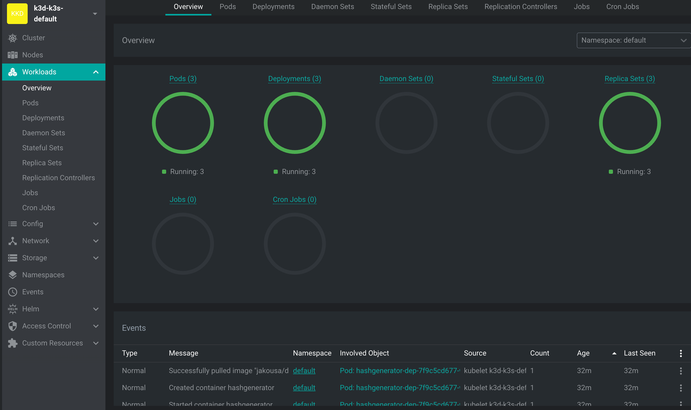
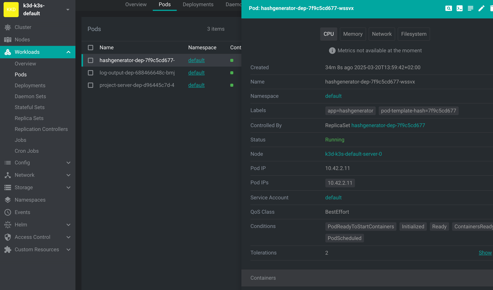

# Introdução à depuração

### Conteúdo
- [Introdução à depuração](#introdução-à-depuração)
  - [O que você aprenderá nesta página](#o-que-você-aprenderá-nesta-página)
  - [Ferramentas preliminares para depuração](#ferramentas-preliminares-para-depuração)
  - [Testando as ferramentas](#testando-as-ferramentas)
    - [kubectl describe no Deployment](#kubectl-describe-no-deployment)
    - [kubectl describe no Pod](#kubectl-describe-no-pod)
    - [kubectl logs](#kubectl-logs)
  - [Usando o Lens](#usando-o-lens)
    - [Adicionando o cluster ao Lens](#adicionando-o-cluster-ao-lens)
    - [Visão geral das Cargas de trabalho](#visão-geral-das-cargas-de-trabalho)
    - [Detalhes do Pod](#detalhes-do-pod)

### O que você aprenderá nesta página
- Estratégias para depurar quando algo não funciona
- Como usar o Lens para explorar recursos do Kubernetes

O Kubernetes é um sistema de "autocura", e voltaremos a esse conceito e a como o Kubernetes realmente funciona no Capítulo 6. Mas, nesta fase, "autocura" já é um conceito importante de entender: normalmente, você (o mantenedor ou o desenvolvedor) não precisa fazer nada caso algo dê errado com um pod ou contêiner.

Às vezes, porém, você precisa interferir, ou pode ter problemas com sua própria configuração. À medida que você tenta encontrar bugs na sua configuração, comece eliminando todas as possibilidades, uma por uma. O segredo é ser sistemático e questionar tudo. Aqui estão as ferramentas preliminares para resolver problemas.

### Ferramentas preliminares para depuração

A primeira é `kubectl describe`, que pode lhe dizer quase tudo o que você precisa saber sobre qualquer recurso.

O segundo é `kubectl logs`, com o qual você pode acompanhar os registros do seu software possivelmente quebrado.

A terceira é que `kubectl delete` simplesmente excluirá o recurso e, em alguns casos, como acontece com os pods em implantação, um novo será liberado automaticamente.

Por fim, temos a ferramenta abrangente Lens "[The Kubernetes IDE](https://lenshq.io/)", que você deve começar a usar agora mesmo para se familiarizar com o uso.

Vamos testar essas ferramentas e experimentar usando o Lens. Você provavelmente enfrentará muitos desafios reais de depuração durante os exercícios!

### Testando as ferramentas

Vamos implantar o aplicativo e ver o que está acontecendo:

```bash
$ kubectl apply -f https://raw.githubusercontent.com/kubernetes-hy/material-example/master/app1/manifests/deployment.yaml
deployment.apps/hashgenerator-dep created
```

#### kubectl describe no Deployment

```bash
$ kubectl describe deployment hashgenerator-dep
Name:                   hashgenerator-dep
Namespace:              default
CreationTimestamp:      Thu, 20 Mar 2025 13:59:42 +0200
Labels:                 <none>
Annotations:            deployment.kubernetes.io/revision: 1
Selector:               app=hashgenerator
Replicas:               1 desired | 1 updated | 1 total | 1 available | 0 unavailable
StrategyType:           RollingUpdate
MinReadySeconds:        0
RollingUpdateStrategy:  25% max unavailable, 25% max surge
Pod Template:
  Labels:  app=hashgenerator
  Containers:
   hashgenerator:
    Image:        jakousa/dwk-app1:b7fc18de2376da80ff0cfc72cf581a9f94d10e64
    Port:         <none>
    Host Port:    <none>
    Environment:  <none>
    Mounts:       <none>
  Volumes:        <none>
Conditions:
  Type           Status  Reason
  ----           ------  ------
  Available      True    MinimumReplicasAvailable
  Progressing    True    NewReplicaSetAvailable
OldReplicaSets:  <none>
NewReplicaSet:   hashgenerator-dep-75bdcc94c (1/1 replicas created)
Events:
  Type    Reason             Age    From                   Message
  ----    ------             ----   ----                   -------
  Normal  ScalingReplicaSet  8m39s  deployment-controller  Scaled up replica set hashgenerator-dep-75bdcc94c to 1
```

Há muitas informações que ainda não estamos prontos para avaliar. Reserve um momento para ler tudo. Existem pelo menos algumas informações importantes que conhecemos, principalmente porque as definimos anteriormente no yaml. Os Eventos são muitas vezes o lugar para procurar erros.

#### kubectl describe no Pod

O comando describe também pode ser usado para outros recursos. Vamos ver o pod a seguir:

```bash
$ kubectl describe pod hashgenerator-dep-75bdcc94c-whwsm
...
Events:
  Type    Reason     Age   From                              Message
  ----    ------     ----  ----                              -------
  Normal  Scheduled  26s   default-scheduler  Successfully assigned default/hashgenerator-dep-7877df98df-qmck9 to k3d-k3s-default-server-0
  Normal  Pulling    15m   kubelet            Pulling image "jakousa/dwk-app1:b7fc18de2376da80ff0cfc72cf581a9f94d10e64"
  Normal  Pulled     26s   kubelet            Container image "jakousa/dwk-app1:b7fc18de2376da80ff0cfc72cf581a9f94d10e64"
  Normal  Created    26s   kubelet            Created container hashgenerator
  Normal  Started    26s   kubelet            Started container hashgenerator
```

Há novamente muita informação, mas desta vez vamos nos concentrar nos acontecimentos. Aqui podemos ver tudo o que aconteceu. O agendador extraiu a imagem com sucesso e iniciou o contêiner no nó chamado "k3d-k3s-default-server-0". Tudo está funcionando como esperado, excelente. O aplicativo está em execução.

#### kubectl logs

Em seguida, vamos verificar se o aplicativo está realmente fazendo o que deveria, lendo os logs.

```bash
$ kubectl logs hashgenerator-dep-75bdcc94c-whwsm
jst944
3c2xas
s6ufaj
cq7ka6
```

Tudo parece estar em ordem. Mas não seria ótimo se houvesse um painel para ver tudo acontecendo? Vamos ver o que a [Lens](https://lenshq.io/) pode fazer.

### Usando o Lens

Atualmente, o Lens requer uma conta para fazer login. Também é possível usar o Freelens, que é a versão gratuita e de código aberto do Lens que não requer login.

#### Adicionando o cluster ao Lens

Primeiro, você precisará adicionar o cluster ao Lens. Se a configuração não estiver disponível no menu suspenso, você pode obter o kubeconfig personalizado com:

```bash
kubectl config view --minify --raw
```

#### Visão geral das Cargas de trabalho

Depois de adicionar o cluster, abra a aba Cargas de trabalho/Visão geral. Uma visualização semelhante à seguinte deve ser aberta.



Na parte inferior, podemos ver todos os eventos e, na parte superior, podemos ver o status dos diferentes recursos em nosso cluster. Tente excluir e reaplicar a implantação e você verá eventos no painel. Esta é a mesma saída que você veria com `kubectl get events`.

#### Detalhes do Pod

Em seguida, vamos navegar até a aba Cargas de trabalho/Pods e clicar em nosso pod com o nome "hashgenerator-dep-...".



A visualização nos mostra as mesmas informações que você obtém com `kubectl describe`. A GUI também nos oferece ações. Os ícones no canto superior direito são:

- Anexe a um pod
- Abra o terminal em um contêiner no pod
- Mostrar logs
- Editar o pod
- Excluir o recurso

>"Por que prefiro usar Lens? Quando você usa o kubectl no terminal para listar pods, não há certeza de que os pods permanecerão inalterados quando você emitir o próximo comando. O Lens, por outro lado, fornece uma interface gráfica dinâmica que é atualizada em tempo real, permitindo que você rastreie visualmente o status de pods e outros objetos conforme eles aparecem, desaparecem ou sofrem alterações." - [Matti Paksula](http://github.com/matti).