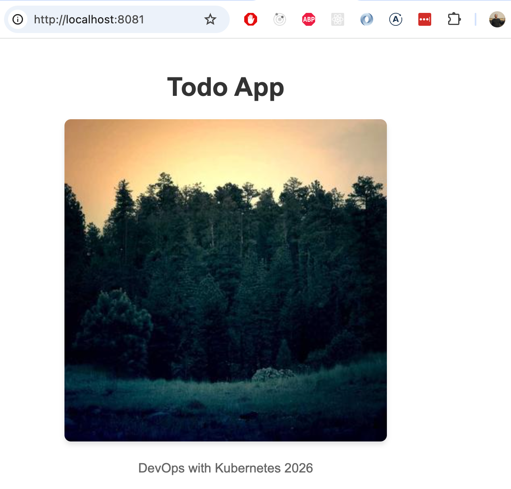
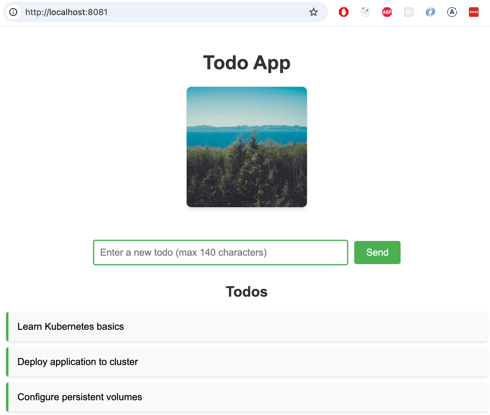

# Introdução ao Armazenamento

### Conteúdo
- [Introdução ao Armazenamento](#introdução-ao-armazenamento)
  - [O que você aprenderá nesta página](#o-que-você-aprenderá-nesta-página)
  - [Volumes emptyDir](#volumes-emptydir)
  - [Volumes Persistentes](#volumes-persistentes)

### O que você aprenderá nesta página
- Usar volumes para compartilhar dados entre dois contêineres em um pod
- Usar volumes persistentes para armazenar dados no disco de um nó

Há duas coisas que são conhecidas por serem difíceis com o Kubernetes. A primeira é a criação de redes. Felizmente, podemos evitar a maioria das dificuldades de rede, a menos que criemos nosso próprio cluster. Se você estiver interessado, pode assistir a este webinar sobre Kubernetes e redes: "[por que isso é tão difícil?](https://www.youtube.com/watch?v=GgCA2USI5iQ)", mas pularemos a maioria dos tópicos discutidos no vídeo. A outra das coisas mais difíceis é o armazenamento.

Neste capítulo, exploraremos uma abordagem muito básica para utilizar o armazenamento no Kubernetes, com planos de revisitar este tópico com mais detalhes posteriormente. Ao contrário da maioria dos aspectos do Kubernetes, que são altamente dinâmicos e capazes de alternar entre nós e replicar sem esforço, o armazenamento apresenta desafios e limitações exclusivos. O artigo ["Por que o armazenamento no Kubernetes é tão difícil?"](https://softwareengineeringdaily.com/articles/why-is-storage-on-kubernetes-is-so-hard/) oferece uma visão abrangente dessas dificuldades e discute várias estratégias para enfrentá-las.

Um [volume](https://docs.docker.com/engine/storage/volumes/) no Docker e no Docker Compose é a maneira de persistir os dados que os contêineres estão usando. No Kubernetes as coisas são muito mais complicadas: existem vários tipos de volumes.

### Volumes emptyDir

Os volumes simples do Kubernetes, em termos técnicos volumes `emptyDir`, são sistemas de arquivos compartilhados dentro de um pod. Isso significa que seu ciclo de vida está vinculado a um pod e, quando o pod é destruído, os dados são perdidos. Além disso, simplesmente mover o pod para outro nó destruirá o conteúdo do volume, pois o espaço é reservado no nó em que o pod está sendo executado. Portanto, você certamente não deve usar volumes `emptyDir`, por exemplo, para fazer backup de um banco de dados. Mesmo com as limitações, ele pode ser usado como cache, pois persiste entre reinicializações de contêineres, ou pode ser usado para compartilhar arquivos entre dois contêineres em um pod.

Antes de começarmos com isso, precisamos de um aplicativo que compartilhe dados com outro aplicativo. Neste caso, funcionará como um método para compartilhar arquivos de log simples entre si. Precisaremos de dois aplicativos:

- **O localizador de imagens**, que verifica se `/usr/src/app/files/image.jpg` existe e, caso contrário, baixa uma imagem aleatória e a salva como `image.jpg`. Qualquer solicitação HTTP acionará uma nova geração de imagem.
- **O respondente de imagem**, que verifica o arquivo `/usr/src/app/files/image.jpg` e o mostra, se estiver disponível.

Os aplicativos compartilham uma implantação para que ambos fiquem dentro do mesmo pod. Uma versão de exemplo está disponível [aqui](https://github.com/kubernetes-hy/material-example/tree/b9ff709b4af7ca13643635e07df7367b54f5c575/app3). O exemplo inclui um Ingress e um Serviço para acessar o aplicativo. O arquivo `deployment.yaml` se parece com o seguinte:

*(Linhas destacadas: 15 a 17, 21, 26)*

```yaml
apiVersion: apps/v1
kind: Deployment
metadata:
  name: images-dep
spec:
  replicas: 1
  selector:
    matchLabels:
      app: images
  template:
    metadata:
      labels:
        app: images
    spec:
      volumes: # Define volume
        - name: shared-image
          emptyDir: {}
      containers:
        - name: image-finder
          image: jakousa/dwk-app3-image-finder:b7fc18de2376da80ff0cfc72cf581a9f94d10e64
          volumeMounts: # Mount volume
          - name: shared-image
            mountPath: /usr/src/app/files
        - name: image-response
          image: jakousa/dwk-app3-image-response:b7fc18de2376da80ff0cfc72cf581a9f94d10e64
          volumeMounts: # Mount volume
          - name: shared-image
            mountPath: /usr/src/app/files
```

Como pode ser visto, a implantação define um volume `emptyDir` que recebe o nome `shared-image`. Ambos os contêineres dentro do pod estão montando o volume no caminho `/usr/src/app/files`.

Agora podemos testar o aplicativo aplicando a implantação, o serviço e a entrada:

```bash
kubectl apply -f https://raw.githubusercontent.com/kubernetes-hy/material-example/b9ff709b4af7ca13643635e07df7367b54f5c575/app3/manifests/deployment.yaml
kubectl apply -f https://raw.githubusercontent.com/kubernetes-hy/material-example/b9ff709b4af7ca13643635e07df7367b54f5c575/app3/manifests/service.yaml
kubectl apply -f https://raw.githubusercontent.com/kubernetes-hy/material-example/b9ff709b4af7ca13643635e07df7367b54f5c575/app3/manifests/ingress.yaml
```

O Ingress fornecido usa a porta 8081 aberta anteriormente, para que possamos obter a imagem com o navegador a partir da URL http://localhost:8081.

Observe que todos os dados são perdidos quando o pod fica inativo, então a imagem que você obtém do respondedor de imagem permanece a mesma enquanto o pod está ativo e em execução, mas muda quando o pod é reiniciado.

> **Exercício 1.10 — Ainda mais serviços**
>
> **Instruções:** Divida o aplicativo "Log output" em dois contêineres diferentes dentro de um único pod:
>
> - Um gera uma string aleatória na inicialização e escreve uma linha com a string aleatória e o registro de data e hora a cada 5 segundos em um arquivo.
> - O outro lê esse arquivo e fornece o conteúdo no endpoint HTTP GET para o usuário ver.
>
> Você pode encontrar [isso](https://kubernetes.io/docs/reference/kubectl/generated/kubectl_logs/) útil agora, pois há mais de um contêiner funcionando dentro de um pod.

### Volumes Persistentes

Em contraste com os volumes `emptyDir`, um [Volume Persistente](https://kubernetes.io/docs/concepts/storage/persistent-volumes/) é algo que você provavelmente tinha em mente quando começamos a falar sobre volumes.

Um Volume Persistente (PV) é um recurso de todo o cluster que representa um pedaço de armazenamento no cluster que foi provisionado pelo administrador do cluster ou é provisionado [dinamicamente](https://kubernetes.io/docs/concepts/storage/dynamic-provisioning/). Volumes persistentes podem ser suportados por vários tipos de armazenamento, como disco local, NFS, armazenamento em nuvem, etc.

Os PVs têm um ciclo de vida independente de qualquer pod individual que use o PV. Isso significa que os dados no PV podem sobreviver ao pod ao qual foram anexados.

Ao usar um provedor de nuvem, como o Google Kubernetes Engine (que usaremos nos Capítulos 4 e 5), é o próprio provedor de nuvem que cuida do armazenamento de suporte e dos Volumes Persistentes que você pode usar. Se você executar seu próprio cluster ou usar um cluster local, como o k3s, para desenvolvimento, precisará cuidar do sistema de armazenamento e dos Volumes Persistentes sozinho.

Uma opção fácil que podemos usar com o K3s é um PersistentVolume [local](https://kubernetes.io/docs/concepts/storage/volumes/#local), que usa um caminho em um nó do cluster como armazenamento. Esta solução vincula o volume a um nó específico e, se o nó ficar indisponível, o armazenamento não será utilizável.

Portanto, os Volumes Persistentes locais **não são** a solução a ser utilizada em produção!

Para que o PersistentVolume funcione, primeiro você precisa criar o caminho local no nó ao qual o vinculamos. Como nosso cluster é executado via Docker, vamos criar um diretório `/tmp/kube` no contêiner `k3d-k3s-default-agent-0`. Isso pode ser feito simplesmente por meio de:

```bash
docker exec k3d-k3s-default-agent-0 mkdir -p /tmp/kube
```

A definição do Volume Persistente é criada no arquivo `persistentvolume.yaml` da seguinte forma:

```yaml
apiVersion: v1
kind: PersistentVolume
metadata:
  name: example-pv
spec:
  storageClassName: my-example-pv # this is the name you are using later to claim this volume
  capacity:
    storage: 1Gi # Could be e.q. 500Gi. Small amount is to preserve space when testing locally
  volumeMode: Filesystem # This declares that it will be mounted into pods as a directory
  accessModes:
  - ReadWriteOnce
  local:
    path: /tmp/kube
  nodeAffinity: ## This is only required for local, it defines which nodes can access it
    required:
      nodeSelectorTerms:
      - matchExpressions:
        - key: kubernetes.io/hostname
          operator: In
          values:
          - k3d-k3s-default-agent-0
```

Para usar um volume persistente, você deve fazer uma [Reivindicação de Volume Persistente](https://kubernetes.io/docs/concepts/storage/persistent-volumes/) (PVC — *PersistentVolumeClaim*), que é uma solicitação de armazenamento.

Quando um usuário cria um PVC, o Kubernetes encontra um PV apropriado que satisfaz os requisitos da reivindicação e os une. Se nenhum PV estiver disponível, dependendo da configuração, o cluster poderá criar dinamicamente um PV que atenda às necessidades da reivindicação.

Uma vez vinculado, o PersistentVolumeClaim é "bloqueado" e só pode ser usado por um Pod (dependendo do modo de acesso especificado). Isso garante que o recurso de armazenamento seja usado exclusivamente pelo pod ao qual está vinculado.

Se não houver Volume Persistente adequado disponível, o PVC permanecerá no estado "Pendente", aguardando um PV adequado.

Conceitualmente, você pode pensar nos PVs como o volume físico (o armazenamento real em sua infraestrutura), enquanto os PVCs são o meio pelo qual os pods reivindicam esse armazenamento para seu uso.

Vamos agora criar uma reivindicação para nosso aplicativo no arquivo `persistentvolumeclaim.yaml`:

```yaml
apiVersion: v1
kind: PersistentVolumeClaim
metadata:
  name: image-claim # name of the volume claim, this will be used in the deployment
spec:
  storageClassName: my-example-pv # this is the name of the persistent volume we are claiming
  accessModes:
    - ReadWriteOnce
  resources:
    requests:
      storage: 1Gi
```

Modifique a implantação introduzida anteriormente para usá-la:

*(Linhas destacadas: 5 a 6)*

```yaml
# ...
    spec:
      volumes:
        - name: shared-image
          persistentVolumeClaim:
            claimName: image-claim
      containers:
        - name: image-finder
          image: jakousa/dwk-app3-image-finder:b7fc18de2376da80ff0cfc72cf581a9f94d10e64
          volumeMounts:
          - name: shared-image
            mountPath: /usr/src/app/files
        - name: image-response
          image: jakousa/dwk-app3-image-response:b7fc18de2376da80ff0cfc72cf581a9f94d10e64
          volumeMounts:
          - name: shared-image
            mountPath: /usr/src/app/files
```

E aplique-o junto com `persistentvolume.yaml` e `persistentvolumeclaim.yaml`:

```bash
$ kubectl apply -f https://raw.githubusercontent.com/kubernetes-hy/material-example/master/app3/manifests/deployment-persistent.yaml
```

Com o serviço anterior e o Ingress, podemos acessar o aplicativo em http://localhost:8081 (abre em uma nova aba). Para confirmar que os dados são persistentes, podemos executar:

```bash
$ kubectl delete -f https://raw.githubusercontent.com/kubernetes-hy/material-example/master/app3/manifests/deployment-persistent.yaml
deployment.apps "images-dep" deleted

$ kubectl apply -f https://raw.githubusercontent.com/kubernetes-hy/material-example/master/app3/manifests/deployment-persistent.yaml
deployment.apps/images-dep created
```

O mesmo arquivo está disponível novamente!

Se você estiver interessado em saber mais sobre como executar seu próprio armazenamento, você pode conferir, por exemplo, o seguinte:

- [Rook](https://rook.io/) 
- [OpenEBS](https://openebs.io/) 
- [Longhorn](https://longhorn.io/) 

> **Exercício 1.11 — Dados persistentes**
>
> **Instruções:** Vamos compartilhar dados entre os aplicativos "Ping-pong" e "Log output" usando volumes persistentes. Crie um PersistentVolume e um PersistentVolumeClaim e altere a implantação para utilizá-los. Como os PersistentVolumes geralmente são mantidos por administradores de cluster em vez de desenvolvedores e não são específicos do aplicativo, você deve manter a definição para eles separada, talvez em sua própria pasta.
>
> Salve o número de solicitações ao aplicativo "Ping-pong" em um arquivo no volume e exiba-o com o registro de data e hora e a sequência aleatória ao enviar uma solicitação ao nosso aplicativo "Log output". No final, os dois pods devem compartilhar um volume persistente entre os dois aplicativos. Portanto, o navegador deve exibir o seguinte ao acessar o aplicativo "Log output":
>
> ```
> 2020-03-30T12:15:17.705Z: 8523ecb1-c716-4cb6-a044-b9e83bb98e43.
> Ping / Pongs: 3
> ```

> **Exercício 1.12 — O projeto, etapa 6**
>
> **Instruções:** Como o projeto parece um pouco chato agora, vamos adicionar uma foto!
>
> O objetivo é adicionar uma imagem horária ao projeto.
>
> - Obtenha uma imagem aleatória do Lorem Picsum (https://picsum.photos/1200) e exiba-a no projeto. Encontre uma maneira de armazenar a imagem para que ela permaneça a mesma por 10 minutos.
> - Após 10 minutos, você pode descartar a foto antiga e, para a próxima solicitação, deve haver uma nova foto.
> - Certifique-se de armazenar a imagem em cache em um volume persistente, para que a API não seja necessária para novas imagens toda vez que acessarmos o aplicativo ou o contêiner travar.
>
> A melhor maneira de testar o que acontece quando seu contêiner é desligado é provavelmente desligando o contêiner, para que você possa adicionar lógica para isso também, para fins de teste.
>
> 

> **Exercício 1.13 — O projeto, etapa 7**
> Tentativas: 1 · Pontos: 0/1 · Prazo: 31 de janeiro de 2027 às 18h59 (UTC−3h00)
>
> **Instruções:** É hora de começar a adicionar alguma funcionalidade real ao nosso projeto! Conforme prometido anteriormente, o projeto terá uma funcionalidade de aplicativo de tarefas. Então, neste exercício:
>
> - Adicione um campo de entrada. A entrada não deve aceitar textos com mais de 140 caracteres.
> - Adicione um botão de envio. Ainda não precisa enviar a tarefa (todo).
> - Adicione uma lista dos todos existentes com alguns todos codificados (hardcoded).
>
> 